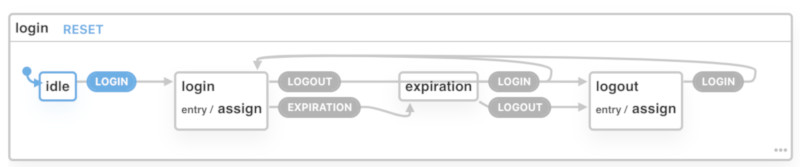

# Login Service

Clientside processing of sso token handling.  Use this service to handle sso authentification based on jwt token.


(https://xstate.js.org/viz/?gist=9a731b21f882ce56eb846be73355188d)

## install
```
npm i @diemtarh/login-service
```

## Usage a.E. in React
```
    import * as loginService from '@diemtarh/login-service';

    loginService.loginService.subscribe(state => {
      switch (state.value) {
        case 'logout':
          console.log('...handleLogout');
          break;
        case 'expiration':
          console.log('...Show expiration message');
          break;
        default:
      }
    });

    const user = parseJWT(auth.token);
    loginService.onLogin({ user, session: { expire: user.exp } });


    ***

    loginService.onLogout();
```

**Login** and **logout** transitions are wrapped as typed functions "onLogin" and "onLogout". 
Handle "expiration" event to handle expiration-state. While expiration-state you can refresh your token and relogin with new expiration timestamp.  

Object "User" has to have the following format: 
```
  admin: boolean;
  firstName: string;
  lastName: string;
  eMail: string;
  id: string;
```

Use **IUser** interface to cust you payload data.
```
interface IUser {
  admin: boolean;
  firstName: string;
  lastName: string;
  eMail: string;
  id: string;
}
```

## Test it
```
npm test
```
Explore '**src/app.spec.ts**' for more understanding.  

